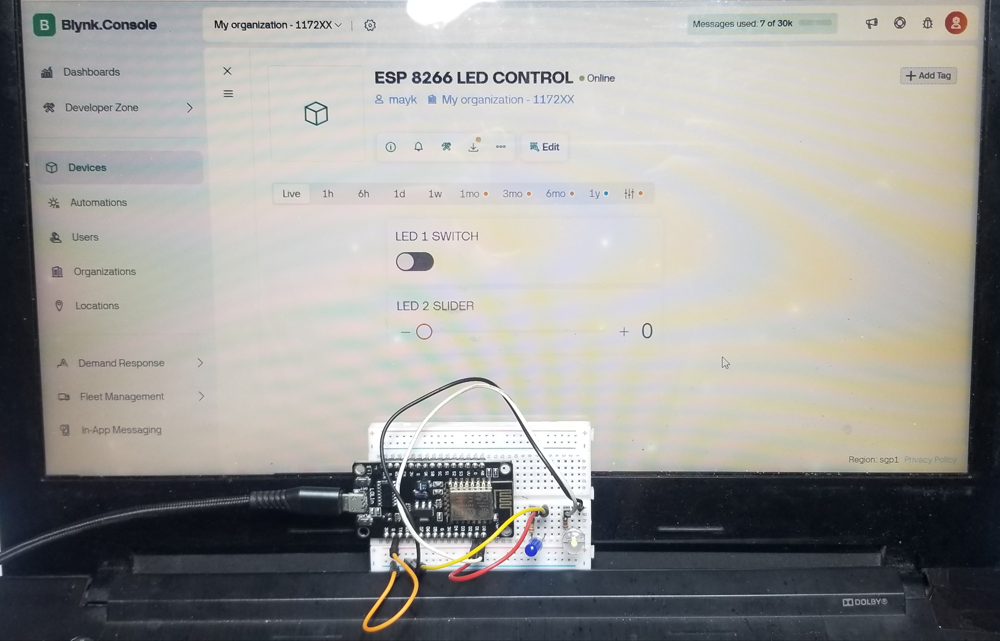
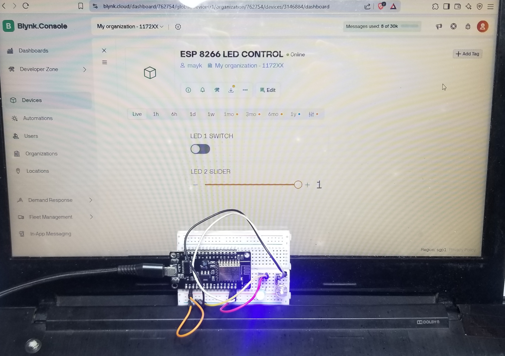
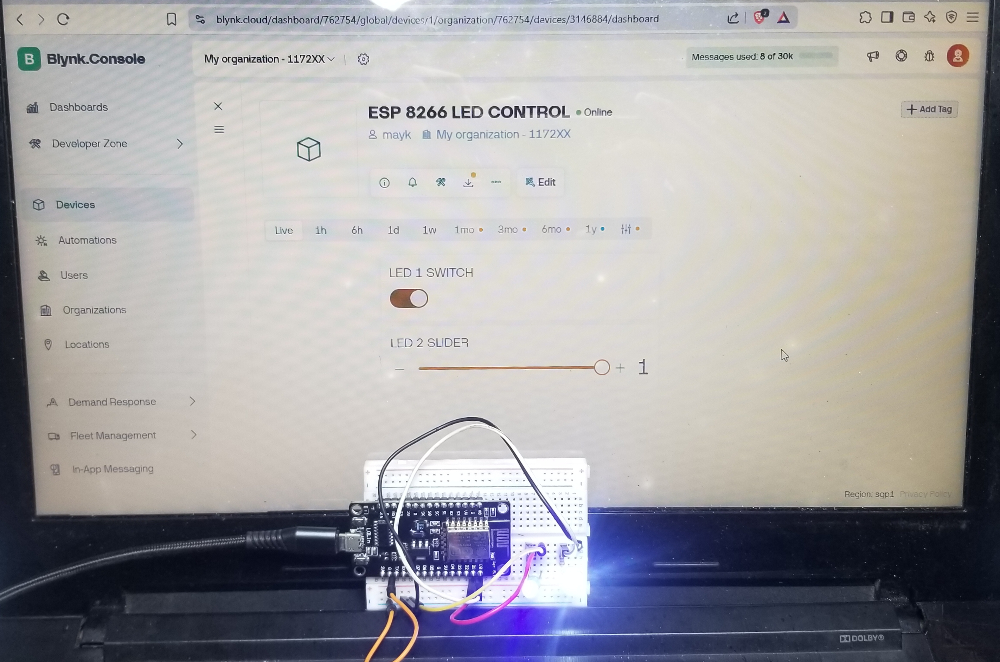

# esp8266-blynk-led-control

Control two LEDs remotely using ESP8266 board through both the Blynk Web Dashboard and the Mobile App.

## Components Used

- ESP8266 
- 2x LED lights
- 2x 220 ohms Resistors 
- Breadboard
- Wi-Fi connection
- Blynk app (iOS/Android)
- Blynk Web Dashboard (blynk.cloud)

## Project Description

A simple project using ESP8266 and Blynk to remotely control two LEDs on D0 and D1. The LEDs are toggled via virtual pins V0 and V1 using the Blynk Web Dashboard and Mobile App.

## Actual Circuit

Basic wiring:
- LED1 anode → D0 via resistor  
- LED2 anode → D1 via resistor  
- Both LED cathodes → GND
### Actual Circuit

## Setup Instructions

1. Open the `esp8266-blynk-led-control.ino` file in the Arduino IDE.
2. Install the required libraries:
   - Blynk
   - ESP8266WiFi
3. Replace the placeholder values in:
   - `BLYNK_TEMPLATE_ID`, `BLYNK_TEMPLATE_NAME`, `BLYNK_AUTH_TOKEN`
   - Wi-Fi `ssid[]` and `pass[]`
4. Upload the code to the ESP8266 board.
5. In the Blynk platform:
   - Create a new template and device.
   - Use Virtual Pin V0 for the LED on D0.
   - Use Virtual Pin V1 for the LED on D1.
   - Create Datastreams for each virtual pin.
   - Add one switch and one slider widget in the Web and Mobile dashboards.
   - Set each button to Switch mode.
### BLYNK WEBPAGE

### BLYNK MOBILE 

6. Start the project and toggle the LEDs remotely.
## Testing the Circuit with Blynk
#### Both LEDs OFF

#### Only LED 1 ON

#### Only LED 2 ON

#### Both LEDs ON

## Notes

This project was built using the updated Blynk IoT platform at [blynk.cloud](https://blynk.cloud). After setting up a template and device on the Blynk dashboard, you'll be able to access your auth token and other credentials needed to connect your ESP8266.